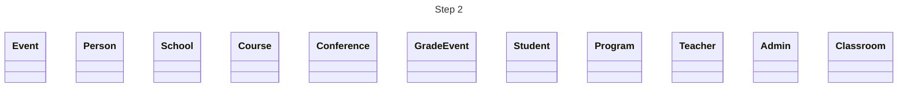
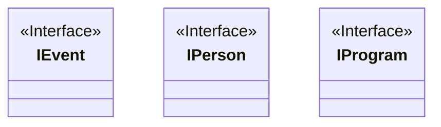
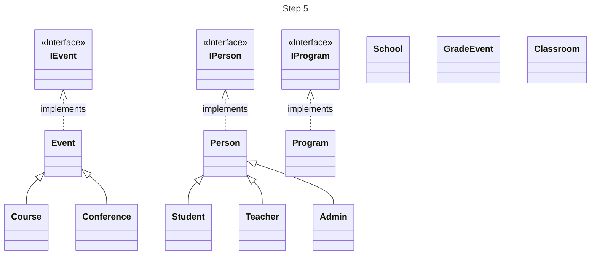
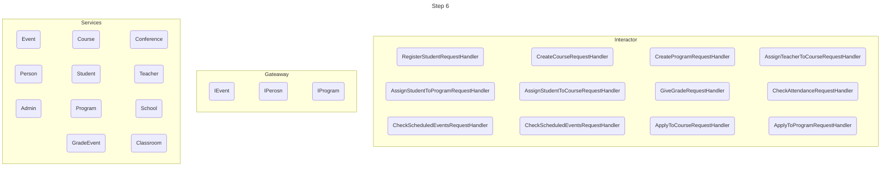

# Step 2 : Define the entity
- Person
- Conference
- GradeEvent
- Program
- Administration
- Teacher
- Student
- School
- Course
- Event
- Classroom




# Step 3 : Define your interactor

site pour savoir comment faire un interactor : https://www.techyourchance.com/how-to-use-case-interactor-java/

**Interfaces pour chaque cas d'utilisation:**

### "Register a Student":

1. Classe Interactor : "RegisterStudentInteractor"
2. Interface : "RegisterStudentRequestHandler"

```java
public class RegisterStudentRequestHandler {
    RegisterStudentResponse handle(RegisterStudentRequest request);
}
```

### "Create a Program":

1. Classe Interactor : "CreateProgramInteractor"
2. Interface : "CreateProgramRequestHandler"

```java
public class CreateProgramRequestHandler {
    CreateProgramResponse handle(CreateProgramRequest request);
}
```

### "Assign Student to a Program":

1. Classe Interactor : "AssignStudentToProgramInteractor"
2. Interface : "AssignStudentToProgramRequestHandler"

```java
public class AssignStudentToProgramRequestHandler {
    AssignStudentToProgramResponse handle(AssignStudentToProgramRequest request);
}
```

### "Create a Course":

1. Classe Interactor : "CreateCourseInteractor"
2. Interface : "CreateCourseRequestHandler"

```java
public class CreateCourseRequestHandler {
    CreateCourseResponse handle(CreateCourseRequest request);
}
```

### "Register a Teacher":

1. Classe Interactor : "RegisterTeacherInteractor"
2. Interface : "RegisterTeacherRequestHandler"

```java
public class RegisterTeacherRequestHandler {
    RegisterTeacherResponse handle(RegisterTeacherRequest request);
}
```

### "Assign Teacher to a Course":

1. Classe Interactor : "AssignTeacherToCourseInteractor"
2. Interface : "AssignTeacherToCourseRequestHandler"

```java
public class AssignTeacherToCourseRequestHandler {
    AssignTeacherToCourseResponse handle(AssignTeacherToCourseRequest request);
}
```

### "Assign Student to Course":

1. Classe Interactor : "AssignStudentToCourseInteractor"
2. Interface : "AssignStudentToCourseRequestHandler"

```java
public class AssignStudentToCourseRequestHandler {
    AssignStudentToCourseResponse handle(AssignStudentToCourseRequest request);
}
```

### "Give Grade":

1. Classe Interactor : "GiveGradeInteractor"
2. Interface : "GiveGradeRequestHandler"

```java
public class GiveGradeRequestHandler {
    GiveGradeResponse handle(GiveGradeRequest request);
}
```

### "Check Attendance":

1. Classe Interactor : "CheckAttendanceInteractor"
2. Interface : "CheckAttendanceRequestHandler"

```java
public class CheckAttendanceRequestHandler {
    CheckAttendanceResponse handle(CheckAttendanceRequest request);
}
```

### "Check Scheduled Events":

1. Classe Interactor : "CheckScheduledEventsInteractor"
2. Interface : "CheckScheduledEventsRequestHandler"

```java
public class CheckScheduledEventsRequestHandler {
    CheckScheduledEventsResponse handle(CheckScheduledEventsRequest request);
}
```

### "Apply to a Course":

1. Classe Interactor : "ApplyToCourseInteractor"
2. Interface : "ApplyToCourseRequestHandler"

```java
public class ApplyToCourseRequestHandler {
    ApplyToCourseResponse handle(ApplyToCourseRequest request);
}
```

### "Apply to a Program":

1. Classe Interactor : "ApplyToProgramInteractor"
2. Interface : "ApplyToProgramRequestHandler"

```java
public class ApplyToProgramRequestHandler {
    ApplyToProgramResponse handle(ApplyToProgramRequest request);
}
```

**Exemple de code général pour implémenter:**

```java
public class UseCaseInterfaces {
    public interface RegisterStudentRequestHandler {
        RegisterStudentResponse handle(RegisterStudentRequest request);
    }

    public interface CreateProgramRequestHandler {
        CreateProgramResponse handle(CreateProgramRequest request);
    }

    // Ajoutez les autres interfaces pour les cas d'utilisation ici
}
```

```java
public class RegisterStudentResponse {
    public Student Stduent;

    public RegisterStudentResponse(Student student) {
        this.Student = student;
    }
}

// Créez des classes similaires pour les autres réponses
```

**Exemple d'Interactor pour le cas d'utilisation "Register a Student":**

```java
class RegisterStudentInteractor implements RegisterStudentRequestHandler {
    @Inject
    IStudentRepository _studentRepo;
    
    @Override
    public RegisterStudentResponse handle(RegisterStudentRequest request) {
        // Logique d'enregistrement de l'étudiant ici
        // Vous pouvez accéder aux données de la requête (request) pour effectuer l'enregistrement
        // Générez un identifiant d'étudiant, enregistrez les données et renvoyez une réponse de confirmation
        if(request.FirstName == null || request.LastName == null || request.ContactInfo == null){
            throw new MissingFields("At least one field is missing");
        }
        // Exemple simplifié
        Student student = new Student(request.FirstName, request.LastName, request.ContactInfo);
        // Enregistrez l'étudiant dans votre système, générez un ID, etc.
        _studentRepo.Add(student);
        // Créez une réponse pour indiquer le succès
        RegisterStudentResponse response = new RegisterStudentResponse(student);
        return response;
    }
}
```

**Exemple d'Interactor pour le cas d'utilisation "Create a Program":**

```java
class CreateProgramInteractor implements CreateProgramRequestHandler {
    @Inject
    IProgramRepository _programRepo;
    @Override
    public CreateProgramResponse handle(CreateProgramRequest request) {
        // Logique de création de programme ici
        // Vous pouvez accéder aux données de la requête (request) pour créer le programme
        // Enregistrez le programme et ses cours associés, générez un identifiant, etc.
        if(request.Name == null || request.Description == null){
            throw new MissingFields("At least one field is missing");
        }
        // Exemple simplifié
        Program program = new Program(request.Name, request.Description);
        // Ajoutez les cours associés au programme, définissez les dates, etc.
        _programRepo.Add();
        // Créez une réponse pour indiquer le succès
        CreateProgramResponse response = new CreateProgramResponse(program);
        return response;
    }
}
```



```mermaid
---
title: Step 3
---
classDiagram
	%% Interactor de chaque use case
	class RegisterStudentRequestHandler {
        <<Interface>>
    }
    class CreateProgramRequestHandler {
        <<Interface>>
    }
    class AssignStudentToProgramRequestHandler {
        <<Interface>>
    }
    class CreateCourseRequestHandler {
        <<Interface>>
    }
    class RegisterTeacherRequestHandler {
        <<Interface>>
    }
    class AssignTeacherToCourseRequestHandler {
        <<Interface>>
    }
    class AssignStudentToCourseRequestHandler {
        <<Interface>>
    }
    class GiveGradeRequestHandler {
        <<Interface>>
    }
    class CheckAttendanceRequestHandler {
        <<Interface>>
    }
    class CheckScheduledEventsRequestHandler {
        <<Interface>>
    }
    class ApplyToCourseRequestHandler {
        <<Interface>>
    }
    class ApplyToProgramRequestHandler {
        <<Interface>>
    }
    
    %% Interface Step 4
    class IEvent {
        <<Interface>>
    }

    class IPerson {
        <<Interface>>
    }
    
    class IProgram {
        <<Interface>>
    }
	
	%% Entité de la step2
    class Event {
    }

    class Person {
    }

    class School {
    }

    class Program {
    }

    class Classroom {
    }
```

# Step 4 : Define your gateaway (interface)

Interface : 

- IEvent
- IPerson
- IProgram





# Step 5 : Define your services (class)




# Step 6 : package diagram

### Package diagram without link



### Test package diagram with link

```mermaid
---
title: Step 6
---
graph TD;
   
    
    subgraph Gateaway
        id13(IEvent)~~~
        id14(IPerosn)~~~
        id15(IProgram)
    end
    subgraph Interactor
        id1(RegisterStudentRequestHandler)-->id14(IPerosn)
        
        id4(CreateCourseRequestHandler) --> id13(IEvent)
        
        id2(CreateProgramRequestHandler) -->id15(IProgram)
        
        id5(AssignTeacherToCourseRequestHandler)-->id14(IPerosn)  
		id5(AssignTeacherToCourseRequestHandler)--> id13(IEvent)
        
        id3(AssignStudentToProgramRequestHandler)-->id14(IPerosn)
        id3(AssignStudentToProgramRequestHandler)-->id15(IProgram)
        
        id6(AssignStudentToCourseRequestHandler) -->id14(IPerosn)
        id6(AssignStudentToCourseRequestHandler) --> id13(IEvent)
        
        id7(GiveGradeRequestHandler) -->id14(IPerosn) 
        id7(GiveGradeRequestHandler) -->id13(IEvent) 
        
        id8(CheckAttendanceRequestHandler) -->id14(IPerosn)
        id8(CheckAttendanceRequestHandler) -->id13(IEvent)
        
        id10(CheckScheduledEventsRequestHandler)-->id14(IPerosn)
        id10(CheckScheduledEventsRequestHandler)-->id13(IEvent)
        
        id11(ApplyToCourseRequestHandler)-->id14(IPerosn) 
        id11(ApplyToCourseRequestHandler)--> id13(IEvent)
        
        id12(ApplyToProgramRequestHandler)-->id14(IPerosn) 
        id12(ApplyToProgramRequestHandler)-->id15(IProgram)
        
    end
    subgraph Services
   	 	id16(Event)-->id13(IEvent)
        id17(Course)-->id16(Event)
        id18(Conference)-->id16(Event)
        id19(Person)-->id14(IPerosn)
        id20(Student)-->id19(Person)
        id21(Teacher)-->id19(Person)
        id22(Admin)-->id19(Person)
        id23(Program)-->id15(IProgram)
        id24(School)~~~
        id25(GradeEvent)~~~
        id26(Classroom)
    end
```



# Step 7 : Controller


Pour cette étape, vous devez concevoir un contrôleur pour votre cas d'utilisation "Inscrire un étudiant". Le contrôleur aura plusieurs responsabilités, notamment :

1. Attendre et récupérer l'entrée de l'utilisateur depuis la console.
2. Instancier l'Interactor et les objets de transfert de données nécessaires (par exemple, la demande du type Request).
3. Utiliser l'Interactor pour gérer le cas d'utilisation en fonction de la demande de l'utilisateur.
4. Instancier un présentateur pour afficher le résultat du cas d'utilisation (la réponse du type Response) à l'utilisateur.

Le contrôleur injectera dans l'Interactor les services nécessaires pour effectuer le travail.

Exemple pour le cas d'utilisation "Inscrire un étudiant" :

1. Le contrôleur attend que l'utilisateur entre les informations personnelles de l'étudiant via la console, par exemple, le nom, le prénom, la date de naissance, etc.
2. Une fois que l'utilisateur a saisi ces informations, le contrôleur instancie l'Interactor "Inscrire un étudiant" et crée un objet de demande (Request) pour encapsuler les données saisies par l'utilisateur.
3. Le contrôleur utilise l'Interactor pour exécuter le cas d'utilisation. L'Interactor prend en charge la logique métier, par exemple, la validation des données, la génération d'un identifiant étudiant, et enregistre l'étudiant.
4. Ensuite, le contrôleur instancie un présentateur pour afficher la réponse à l'utilisateur. Par exemple, le présentateur pourrait afficher un message de confirmation indiquant que l'inscription de l'étudiant a été réussie, et il peut afficher l'identifiant de l'étudiant nouvellement inscrit.

Le contrôleur joue un rôle clé dans la gestion de l'interaction utilisateur et l'orchestration du cas d'utilisation "Inscrire un étudiant". Il s'assure que les informations de l'utilisateur sont correctement traitées et que le résultat est présenté de manière appropriée.

