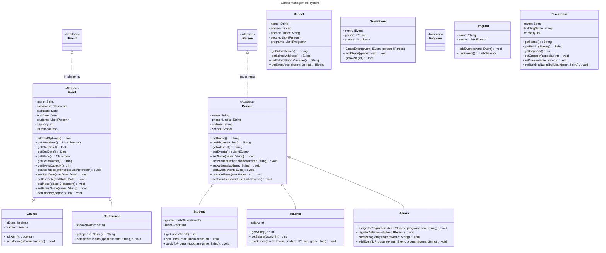

# UML diagra

```mermaid
---
title: School management system
---

classDiagram
    class IEvent {
        <<Interface>>
    }

    class IPerson {
        <<Interface>>
    }

    class Event {
        <<Abstract>>
        - name: String
        - classroom: Classroom
        - startDate: Date
        - endDate: Date
        - students: List~IPerson~
        - capacity: int
        - isOptional: bool
        + isEventOptional(): bool
        + getAttendees(): List~IPerson~
        + getStartDate(): Date
        + getEndDate(): Date
        + getPlace(): Classroom
        + getEventName(): String
        + getEventCapacity(): int
        + setAttendees(attendees: List~IPerson~): void
        + setStartDate(startDate: Date): void
        + setEndDate(endDate: Date): void
        + setPlace(place: Classroom): void
        + setEventName(name: String): void
        + setCapacity(capacity: int): void
    }

    class Person {
        <<Abstract>>
        - name: String
        - phoneNumber: String
        - address: String
        - school: School
        + getName(): String
        + getPhoneNumber(): String
        + getAddress(): String
        + getEvents(): List~IEvent~
        + setName(name: String): void
        + setPhoneNumber(phoneNumber: String): void
        + setAddress(address: String): void
        + addEvent(event: Event): void
        + removeEvent(eventIndex: int): void
        + setEventList(eventList: List~IEvent~): void
    }

    IEvent <|.. Event : implements
    IPerson <|.. Person : implements

    class School {
        - name: String
        - address: String
        - phoneNumber: String
        - people: List~IPerson~
        - programs: List~IProgram~
        + getSchoolName(): String
        + getSchoolAddress(): String
        + getSchoolPhoneNumber(): String
        + getEvent(eventName: String): IEvent
    }

    class Course {
        - isExam: boolean
        - teacher: IPerson
        + isExam(): boolean
        + setIsExam(isExam: boolean): void
    }

    class Conference {
        - speakerName: String
        + getSpeakerName(): String
        + setSpeakerName(speakerName: String): void
    }

    Person <|-- Student
    Person <|-- Teacher
    Person <|-- Admin

    Event <|-- Course
    Event <|-- Conference

    class GradeEvent {
        - event: IEvent
        - person: IPerson
        - grades: List~float~
        + GradeEvent(event: IEvent, person: IPerson)
        + addGrade(grade: float): void
        + getAverage(): float
    }

    class Student {
        - grades: List~GradeEvent~
        - lunchCredit: int
        + getLunchCredit(): int
        + setLunchCredit(lunchCredit: int): void
        + applyToProgram(programName: String): void
    }

    class IProgram {
        <<Interface>>
    }

    class Program {
        - name: String
        - events: List~IEvent~
        + addEvent(event: IEvent): void
        + getEvents(): List~IEvent~
    }

    class Teacher {
        - salary: int
        + getSalary(): int
        + setSalary(salary: int): int
        + giveGrade(event: IEvent, student: IPerson, grade: float): void
    }

    class Admin {
        + assignToProgram(student: Student, programName: String): void
        + registerAPerson(student: IPerson): void
        + createProgram(programName: String): void
        + addEventToProgram(event: IEvent, programName: String): void
    }

    class Classroom {
        - name: String
        - buildingName: String
        - capacity: int
        + getName(): String
        + getBuildingName(): String
        + getCapacity(): int
        + setCapacity(capacity: int): void
        + setName(name: String): void
        + setBuildingName(buildingName: String): void
    }

```